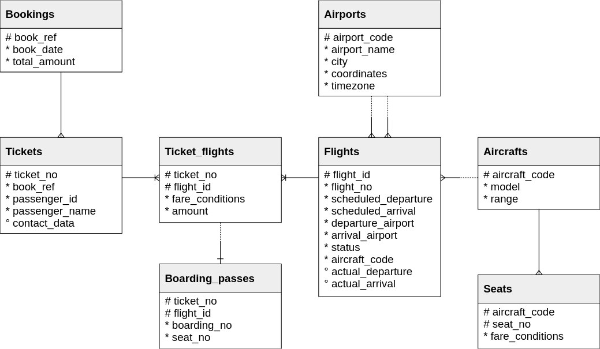

# Application Architecture

Прежде чем разработать приложение, стоит определить основные сервисы на основе технического задания:
+ [**База данных**](#database)
    > Приложение построено на данных взятых с оффициального сайта Postgres, сервис монтирования контейнера с дампом находится в корневой директории, в папке **"database"**.

## Database

Логическая схема: 

Описание схемы:

Основной сущностью является **Bookings**(бронирования).

В одно бронирование может быть включено несколько пассажиров с билетом (**tickets**). Билет хранит информацию о пассажире

Билет может иметь несколько сегментов полета (**ticket_flights**) 

Каждый рейс (**flights**) отправляется из одного аэропорта в другой (**airports**).  Рейсы с одинаковым номером имеют одинаковые пункты отправления и назначения, но различаются датой вылета. 

При регистрации на рейс пассажиру выдается посадочный талон (**boarding_passes**), где указан номер места. Пассажир может зарегистрироваться на рейс только в том случае, если этот рейс включен в билет. 

Количество мест (**seats**) в самолете и их распределение по разным классам обслуживания зависит от модели самолета (**aircrafts**). 